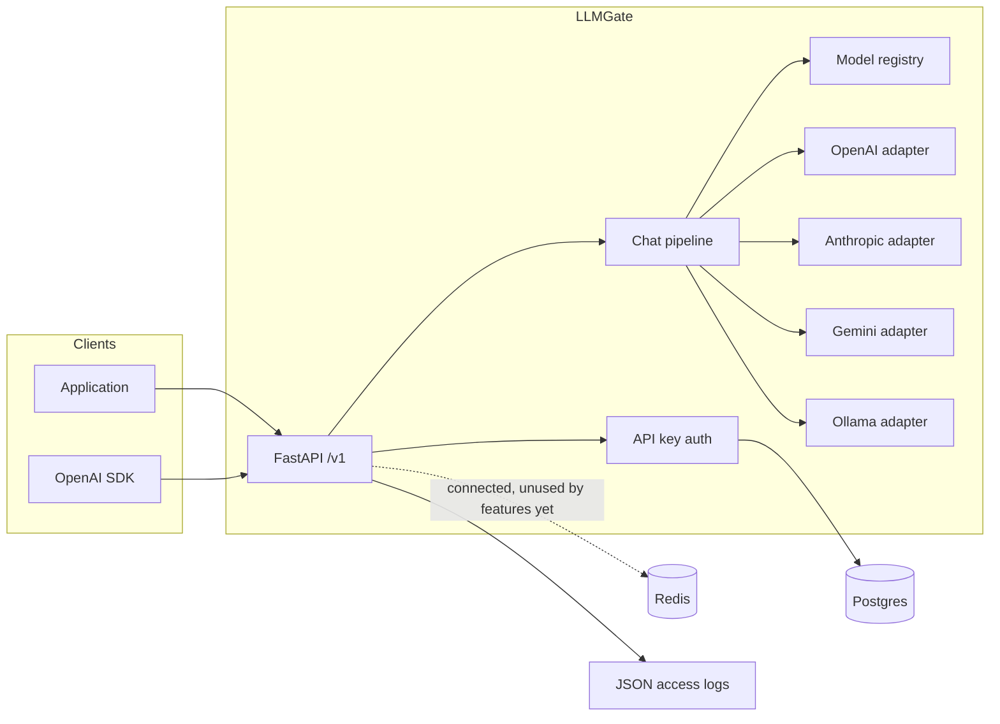

# LLMGate

LLMGate is an OpenAI-compatible HTTP gateway. Applications keep using the OpenAI chat API — or the official OpenAI SDK with a different `base_url` — and LLMGate routes each call to OpenAI, Anthropic, Gemini, or a local Ollama daemon.

Gateway API keys are hashed in Postgres. Provider credentials live only in the gateway's environment, so client apps never see them.



The chat pipeline is the extension point for later milestones: retries, fallback, caching, routing, and guardrails wrap that class instead of the HTTP handlers.

## Quickstart

Docker Compose is the supported way to run the gateway. Copy the example env file if you want to set provider keys or replace the dev secrets; Compose starts without it.

```bash
cp .env.example .env   # optional
docker compose up --build
```

The gateway listens on `http://localhost:8000`. `GET /healthz` checks Postgres and Redis. Interactive API docs are at `http://localhost:8000/docs`.

Create a gateway key (the raw value is printed once):

```bash
docker compose exec gateway llmgate keys create --name demo
```

List or revoke keys:

```bash
docker compose exec gateway llmgate keys list
docker compose exec gateway llmgate keys revoke <key-id>
```

The same operations are HTTP endpoints protected by `LLMGATE_MASTER_KEY` (`Authorization: Bearer <master key>`):

- `POST /admin/keys` with `{"name": "demo"}`
- `GET /admin/keys`
- `DELETE /admin/keys/{id}`

Non-streaming chat:

```bash
curl http://localhost:8000/v1/chat/completions \
  -H "Authorization: Bearer $LLMGATE_API_KEY" \
  -H "Content-Type: application/json" \
  -d '{
    "model": "gpt-4o-mini",
    "messages": [{"role": "user", "content": "Say hello in one sentence."}]
  }'
```

Streaming (`-N` disables curl's buffer):

```bash
curl -N http://localhost:8000/v1/chat/completions \
  -H "Authorization: Bearer $LLMGATE_API_KEY" \
  -H "Content-Type: application/json" \
  -d '{
    "model": "gpt-4o-mini",
    "stream": true,
    "messages": [{"role": "user", "content": "Say hello in one sentence."}]
  }'
```

The stream is Server-Sent Events in OpenAI chunk format and ends with `data: [DONE]`.

### OpenAI Python SDK

```python
from openai import OpenAI

client = OpenAI(
    base_url="http://localhost:8000/v1",
    api_key="sk-lg-...",  # gateway key, not the provider key
)

response = client.chat.completions.create(
    model="gpt-4o-mini",
    messages=[{"role": "user", "content": "Say hello in one sentence."}],
)
print(response.choices[0].message.content)

stream = client.chat.completions.create(
    model="ollama/llama3.2",
    messages=[{"role": "user", "content": "Say hello in one sentence."}],
    stream=True,
)
for chunk in stream:
    if chunk.choices and chunk.choices[0].delta.content:
        print(chunk.choices[0].delta.content, end="")
```

Provider keys (`OPENAI_API_KEY`, `ANTHROPIC_API_KEY`, `GEMINI_API_KEY`) are read from the environment. Ollama does not need a key; set `OLLAMA_BASE_URL`. From inside Compose the host daemon is `http://host.docker.internal:11434`, which is the default.

## Models

`config/models.yaml` maps a public model id to a provider and an upstream model name. `GET /v1/models` lists those entries.

A name with a provider prefix skips the registry and selects the provider directly:

| Request model | Provider | Upstream model |
| --- | --- | --- |
| `gpt-4o-mini` | openai | `gpt-4o-mini` |
| `claude-3-5-sonnet` | anthropic | `claude-3-5-sonnet-20241022` |
| `anthropic/claude-3-5-sonnet-20241022` | anthropic | `claude-3-5-sonnet-20241022` |
| `gemini-2.0-flash` | gemini | `gemini-2.0-flash` |
| `ollama/llama3.2:latest` | ollama | `llama3.2:latest` |

Only `n=1` is supported. Tool calling is forwarded to OpenAI and rejected for the other providers with an OpenAI-style 400. Errors from every provider are returned as `{"error": {"message", "type", "param", "code"}}`.

## Configuration

| Variable | Purpose |
| --- | --- |
| `LLMGATE_DATABASE_URL` | Async SQLAlchemy URL (`postgresql+asyncpg://...`) |
| `LLMGATE_REDIS_URL` | Redis URL. Connected on startup; rate limiting arrives in milestone 2 |
| `LLMGATE_MASTER_KEY` | Bearer token for `/admin` and not a gateway key |
| `LLMGATE_KEY_PEPPER` | HMAC pepper for gateway key hashes. Changing it invalidates existing keys |
| `LLMGATE_MODELS_PATH` | Registry YAML. Default `config/models.yaml` |
| `LLMGATE_LOG_LEVEL` | Structlog level. Access lines are JSON |
| `OPENAI_API_KEY` / `OPENAI_BASE_URL` | OpenAI credentials and optional compatible base URL |
| `ANTHROPIC_API_KEY` / `ANTHROPIC_BASE_URL` | Anthropic Messages API |
| `GEMINI_API_KEY` / `GEMINI_BASE_URL` | Gemini `generateContent` |
| `OLLAMA_BASE_URL` | Ollama daemon, native `/api/chat` |

The dev Compose file ships with a known master key and database password. Change `LLMGATE_MASTER_KEY`, `LLMGATE_KEY_PEPPER`, and the Postgres password before exposing the process.

Each request gets an `X-Request-ID` (honored if the caller sends one). The access log records that id plus status, latency, model, provider, key id, and token counts. Prompts and API keys are not logged.

## Roadmap

- [x] Milestone 1 — OpenAI-compatible endpoint, provider adapters, streaming, API keys
- [ ] Milestone 2 — Retries with backoff, provider fallback, circuit breakers, Redis token-bucket rate limiting
- [ ] Milestone 3 — Semantic caching (embeddings + Redis vector similarity) and a load-testing baseline
- [ ] Milestone 4 — Complexity-based smart model routing, per-team budgets, PII masking, prompt-injection guardrails
- [ ] Milestone 5 — Request logging with cost/latency/tokens, append-only audit trail, Prometheus + Grafana, Next.js admin dashboard (keys, teams, RBAC, budgets, routing rules, usage)
- [ ] Milestone 6 — Deployment, CI hardening, benchmark report, design-doc README

Why these choices were made, and where the next milestones attach, is in [docs/design/001-architecture.md](docs/design/001-architecture.md).

## Project structure

```
src/llmgate/
  main.py            FastAPI app, lifespan, OpenAI-shaped errors
  cli.py             llmgate keys create | list | revoke
  config.py          Environment settings
  logging.py         JSON access log
  api/               Routes, auth dependencies, SSE, request-id middleware
  core/              Request/response schemas, model registry, chat pipeline
  providers/         OpenAI, Anthropic, Gemini, and Ollama adapters
  storage/           SQLAlchemy models, Alembic startup, key hashing
config/models.yaml   Public model id -> provider
alembic/             Postgres schema migrations
tests/               Adapter, streaming, auth, CLI, and OpenAI SDK tests
```

## Development

Requires Python 3.12.

```bash
make install
make ci          # ruff, mypy, pytest
```

Adapter tests mock HTTP with `respx` and do not call real providers. Auth tests run against SQLite. CI also applies the Alembic migration to Postgres and round-trips a key.

Run the gateway on the host only if Postgres and Redis are already reachable and `alembic.ini` is on the working directory path:

```bash
make run
```

`docker compose up` is the path that matches production wiring: the process applies migrations on startup, then serves.

## License

MIT. See [LICENSE](LICENSE).
